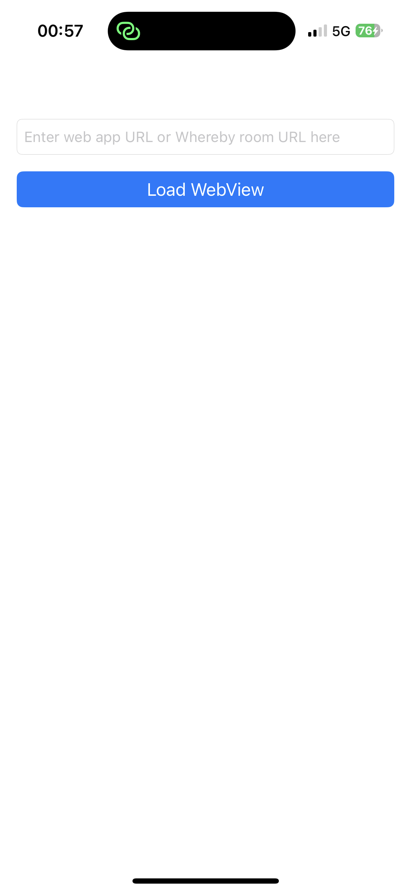
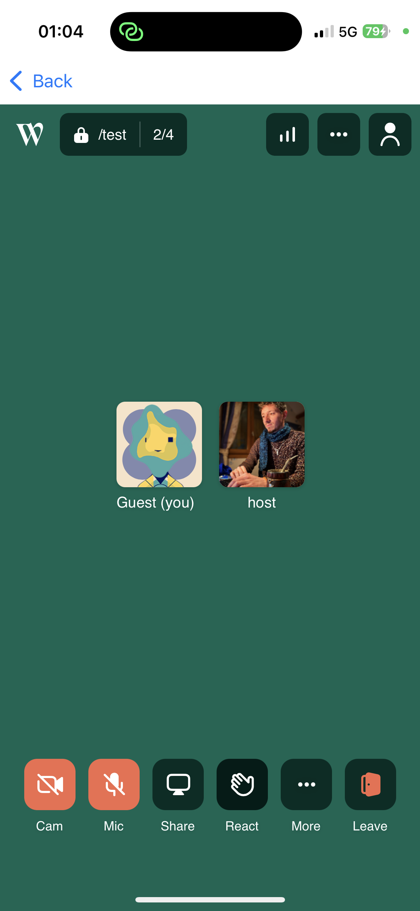

# Whereby WebView Demo - iOS

## Overview

This project is a demo app in Swift showcasing how to embed [Whereby](https://whereby.com/) in a `WKWebView` within a native iOS app. More details about Whereby can be found in the [Whereby documentation](https://docs.whereby.com/).

| Screen 1 | Screen 2 |
|-------------|-------------|
|  |  |

## Prerequisites

- The latest version of Xcode installed
- A Whereby room URL or a web app embedding Whereby

## Features

- The initial screen allows the user to input a URL, which can be:
  - A Whereby [room URL](https://whereby.com/information/select-product) (either 'Meetings' or 'Embedded').
  - A web app that embeds Whereby using the [Whereby Embed Element](https://docs.whereby.com/reference/using-the-whereby-embed-element)
  - A web app that embeds Whereby using the [Whereby React Hooks](https://docs.whereby.com/reference/react-hooks-reference)
- Handles media permission prompts for microphone and camera access.
- Manages external links within the WebView.
- Supports file downloads.

## Installation

1. Clone this repository:
   ```sh
   git clone https://github.com/whereby/ios-webview-demo.git
   cd WherebyWebViewDemo-iOS
   ```
2. Open `WherebyWebViewDemo-iOS.xcodeproj` in Xcode.
3. Ensure you have an Apple Developer account set up.
4. (Optional) To run the app on a physical device, navigate to **Signing & Capabilities** in the project settings and set up a valid development team.
5. Build and run the app on a simulator or a physical device.

## Usage

1. Launch the app.
2. Enter a valid URL in the input field.
3. Tap the "Load Webview" button.

## Code Overview

To fully utilize the app's features, the following permissions must be configured in the info.plist file:

1. **NSMicrophoneUsageDescription** - [Microphone Access](https://developer.apple.com/documentation/bundleresources/information_property_list/nsmicrophoneusagedescription)
2. **NSCameraUsageDescription** - [Camera Access](https://developer.apple.com/documentation/bundleresources/information_property_list/nscamerausagedescription)
3. **NSPhotoLibraryUsageDescription** - [Photo Library Access](https://developer.apple.com/documentation/bundleresources/information_property_list/nsphotolibraryusagedescription)
4. **NSPhotoLibraryAddUsageDescription** - [Photo Library Additions](https://developer.apple.com/documentation/bundleresources/information_property_list/nsphotolibraryaddusagedescription)

The WebViewController.swift file contains the implementation of `WKWebView` and its delegate methods, including:
- Usage of `WKWebViewConfiguration` to enable inline media playback.
- Handling microphone and camera permission to automatically grant media access to the WebView without repeated prompts.
- Managing links that open in new windows/tabs.
- Supporting file downloads and presenting a document picker.

If loading a Whereby meeting room URL, you can combined [URL parameters](https://docs.whereby.com/whereby-101/customizing-rooms/using-url-parameters) to customize the user experience. We recommend using `skipMediaPermissionPrompt` as the `WKWebView` already handles the media permission prompt. 

## Resources
- [Apple WKWebView Documentation](https://developer.apple.com/documentation/webkit/wkwebview)

## License
This project is licensed under the MIT License. See `LICENSE` for details.
